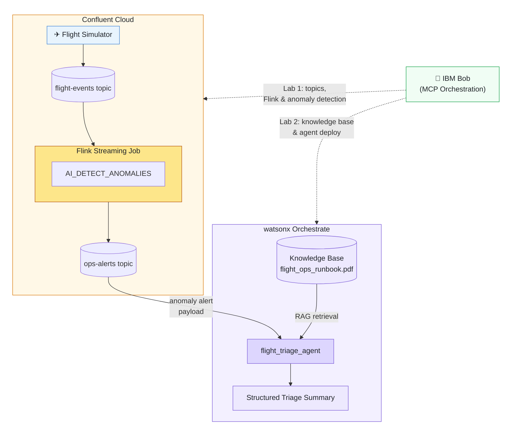

# Workshop Labs: Streaming AI with IBM Bob, Confluent Cloud & watsonx Orchestrate

Welcome to the hands-on workshop labs for the **Hackathon Track: Streaming AI with IBM Bob, Confluent Cloud & watsonx Orchestrate**.

In these labs, you will learn how to use **IBM Bob** as an intelligent developer and operational assistant to configure, deploy, orchestrate, and test real-time event streaming pipelines and AI agent workflows through natural language prompts.

---

## Getting Started: Clone the Repository

Before starting the labs, clone this repository to your local machine and navigate into the `workshop-labs` directory:

```bash
git clone https://github.com/ibm-build-lab/SWA-Hackathon-2026-assets.git
cd SWA-Hackathon-2026-assets/workshop-labs
```

Open this folder in your IDE or workspace where IBM Bob is configured.

---

## Available Labs

### [Prerequisite Lab: Installing and Setting Up IBM Bob](Install-Bob.md)
**Focus:** Tooling, IDE Installation, Authentication & Shell Setup

In this introductory guide, you will install the IBM Bob IDE application (macOS, Windows, or Linux), sign in with your IBMid, optionally install Bob Shell (CLI), and verify your MCP configuration interface.

---

### [Lab 1: Bob + Confluent — Real-Time Flight Anomaly Detection](Bob-and-Confluent.md)
**Focus:** Real-Time Stream Processing & In-Stream AI

In this lab, you configure the Confluent MCP server in Bob, inspect live telemetry streams, create Kafka topics, and deploy streaming Flink SQL jobs with in-stream AI anomaly detection (`AI_DETECT_ANOMALIES`).

**Key Highlights:**
- **MCP Configuration:** Connect Bob to Confluent Cloud via `@confluentinc/mcp-confluent`.
- **Stream Discovery:** Explore live `flight-events` streams and Schema Registry definitions.
- **Topic & Table Management:** Provision the `ops-alerts` destination topic and deploy Flink table DDL.
- **Streaming Anomaly Detection:** Run a continuous Flink SQL job with tumbling time windows and machine learning models to detect flight delays, gate conflicts, and turnaround anomalies in real time.

---

### [Lab 2: Bob + watsonx Orchestrate — Flight Triage Agent & Knowledge Base Setup](Bob-and-WXO.md)
**Focus:** Agentic AI, RAG Knowledge Retrieval & Incident Triage

In this lab, you configure the watsonx Orchestrate (WXO) ADK MCP server in Bob, load an operational standard operating procedure (SOP) PDF into a vector knowledge base, and deploy a native flight triage agent that diagnoses anomalies and recommends mitigation steps.

**Key Highlights:**
- **MCP Configuration:** Connect Bob to watsonx Orchestrate via `ibm-watsonx-orchestrate-mcp-server`.
- **Knowledge Base Ingestion:** Import and index `flight_ops_runbook.pdf` (`flight_ops_runbook.yaml`) to enable vector RAG retrieval.
- **Native Agent Deployment:** Deploy the `flight_triage_agent` attached directly to the Runbook knowledge base.
- **Automated Triage & Interaction:** Test real-time anomaly payloads against the triage agent to retrieve structured mitigation actions (§1 Gate Operations, §2 Departure Delays, §3 Turnaround Disruptions).

---

### [Lab 2 (No-Code Alternative): Build the Flight Triage Agent via the WXO UI](WXO-No-Code.md)
**Focus:** Agentic AI — Browser-Only, No CLI Required

In this lab, you build the exact same `flight_triage_agent` as Lab 2 entirely through the watsonx Orchestrate browser UI — no code, no terminal, no MCP configuration needed. Ideal for participants who prefer a point-and-click workflow.

**Key Highlights:**
- **Knowledge Base:** Upload and index `flight_ops_runbook.pdf` directly in the WXO console.
- **Agent Builder:** Configure the agent name, model, style, instructions, and knowledge base attachment through form fields.
- **In-Browser Testing:** Send CRITICAL, HIGH, and LOW severity anomaly alerts via the WXO chat preview panel.
- **Equivalent Outcome:** Produces the same deployed agent and validated triage results as the Bob-driven Lab 2 path.

---

## Lab Architecture & Data Flow



---

## Repository Structure

```
workshop-labs/
├── README.md                          # This file
├── Install-Bob.md                     # Prerequisite: IBM Bob Installation & Setup
├── Bob-and-Confluent.md               # Lab 1: Confluent Cloud & Flink Anomaly Detection
├── Bob-and-WXO.md                     # Lab 2: watsonx Orchestrate & Knowledge Base Triage
├── WXO-No-Code.md                     # Lab 2 (No-Code Alt): WXO UI — Flight Triage Agent
├── mcp.json                           # Bob MCP configuration template
├── flink/
│   ├── alerts_table.sql               # Flink SQL DDL for ops-alerts table
│   └── anomaly_detection.sql          # Flink SQL streaming anomaly detection job
└── orchestrate/
    ├── agents/
    │   └── flight_triage_agent.yaml   # Native flight triage agent specification
    └── knowledge-bases/
        ├── flight_ops_runbook.yaml    # Knowledge base specification
        └── flight_ops_runbook.pdf     # Flight operations runbook SOP document
```
