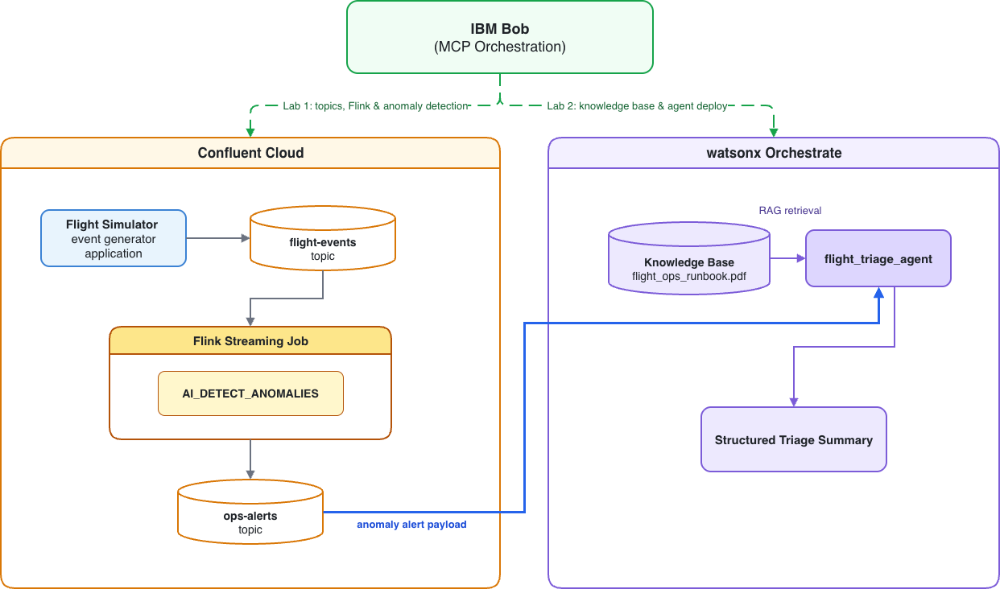

# Workshop Labs: Streaming AI with IBM Bob, Confluent Cloud & watsonx Orchestrate

Welcome to the hands-on workshop labs for the **Hackathon Track: Streaming AI with IBM Bob, Confluent Cloud & watsonx Orchestrate**.

In these labs, you will learn how to use **IBM Bob** as an intelligent developer and operational assistant to configure, deploy, orchestrate, and test real-time event streaming pipelines and AI agent workflows through natural language prompts.

---

## The Story

AeroX Airlines monitors 4 aircraft across ORD and DFW hubs in real time. They want to handle problems proactively by detecting ground operations anomalies from live flight telemetry in milliseconds, and immediately triage them with an AI agent grounded in airline Standard Operating Procedures (SOPs)."


---
## Lab Architecture & Data Flow




When a **Confluent Flink** job
detects an anomalous spike in **gate wait times**, **departure delays**, or **turnaround duration** —
a **Triage Agent** in watsonx Orchestrate can evaluate the alert using a RAG knowledge 
base of gate operations procedures and respond with a mitigation plan.

---

## First Step: Get the Repository

Before starting the labs, download and unzip a local copy of this repository:

### Option A — Command Line (`curl` + `unzip`):

Open a terminal and run these commands one at a time:

```bash
curl -L -o SWA-Hackathon-2026-assets.zip https://github.com/annumberhocker/SWA-Hackathon-2026-assets/archive/refs/heads/main.zip
unzip SWA-Hackathon-2026-assets-main.zip
mv SWA-Hackathon-2026-assets-main SWA-Hackathon-2026-assets
cd SWA-Hackathon-2026-assets/workshop-labs
```

### Option B — Browser Download:

1. Open [https://github.com/annumberhocker/SWA-Hackathon-2026-assets](https://github.com/annumberhocker/SWA-Hackathon-2026-assets) in your browser.
2. Click the green **Code** button → **Download ZIP** (saves `SWA-Hackathon-2026-assets-main.zip` to your Downloads folder).
3. Open a terminal and run the unzip command for your operating system:

**macOS / Linux:**
```bash
# Unzip to your home folder and navigate into workshop-labs
unzip ~/Downloads/SWA-Hackathon-2026-assets-main.zip -d ~/
mv SWA-Hackathon-2026-assets-main SWA-Hackathon-2026-assets
cd ~/SWA-Hackathon-2026-assets/workshop-labs
```

**Windows (PowerShell):**
```powershell
# Unzip to your user folder and navigate into workshop-labs
Expand-Archive -Path "$HOME\Downloads\SWA-Hackathon-2026-assets-main.zip" -DestinationPath "$HOME"
mv "$HOME\SWA-Hackathon-2026-assets-main" ""$HOME\SWA-Hackathon-2026-assets"
cd "$HOME\SWA-Hackathon-2026-assets-main\workshop-labs"
```

---
## Prerequisite For the Bob Labs

### [Installing and Setting Up IBM Bob](Install-Bob.md)
**Focus:** Tooling, IDE Installation, Authentication & Shell Setup
**Required for:** Lab 1 (`Bob-and-Confluent.md`) and Lab 2 (`Bob-and-WXO.md`) — complete this before starting any `Bob-and-*` lab.

In this introductory guide, you will install the IBM Bob IDE application (macOS, Windows, or Linux), sign in with your IBMid, optionally install Bob Shell (CLI), and verify your MCP configuration interface.

---
## Available Labs

### [Lab 1: Bob + Confluent — Real-Time Flight Anomaly Detection](Bob-and-Confluent.md)
**Focus:** Real-Time Stream Processing & In-Stream AI

In this lab, you configure the Confluent MCP server in Bob, inspect live telemetry streams, create Kafka topics, and deploy streaming Flink SQL jobs with in-stream AI anomaly detection (`AI_DETECT_ANOMALIES`).

**Key Highlights:**
- **MCP Configuration:** Connect Bob to Confluent Cloud via `@confluentinc/mcp-confluent`.
- **Stream Discovery:** Explore live `flight-events` streams and Schema Registry definitions.
- **Topic & Table Management:** Provision the `ops-alerts` destination topic and deploy Flink table DDL.
- **Streaming Anomaly Detection:** Run a continuous Flink SQL job with tumbling time windows and machine learning models to detect flight delays, gate conflicts, and turnaround anomalies in real time.

---

### [Lab 2: Bob + watsonx Orchestrate — Flight Triage Agent & Knowledge Base Setup](Bob-and-WXO.md)
**Focus:** Agentic AI, RAG Knowledge Retrieval & Incident Triage

In this lab, you configure the watsonx Orchestrate (WXO) ADK MCP server in Bob, load an operational standard operating procedure (SOP) PDF into a vector knowledge base, and deploy a native flight triage agent that diagnoses anomalies and recommends mitigation steps.

**Key Highlights:**
- **MCP Configuration:** Connect Bob to watsonx Orchestrate via `ibm-watsonx-orchestrate-mcp-server`.
- **Knowledge Base Ingestion:** Import and index `flight_ops_runbook.pdf` (`flight_ops_runbook.yaml`) to enable vector RAG retrieval.
- **Native Agent Deployment:** Deploy the `flight_triage_agent` attached directly to the Runbook knowledge base.
- **Automated Triage & Interaction:** Test real-time anomaly payloads against the triage agent to retrieve structured mitigation actions (§1 Gate Operations, §2 Departure Delays, §3 Turnaround Disruptions).

---

### [Lab 2 (No-Code Alternative): Build the Flight Triage Agent via the WXO UI](WXO-No-Code.md)
**Focus:** Agentic AI — Browser-Only, No CLI Required

In this lab, you build the exact same `flight_triage_agent` as Lab 2 entirely through the watsonx Orchestrate browser UI — no code, no terminal, no MCP configuration needed. Ideal for participants who prefer a point-and-click workflow.

**Key Highlights:**
- **Knowledge Base:** Upload and index `flight_ops_runbook.pdf` directly in the WXO console.
- **Agent Builder:** Configure the agent name, model, style, instructions, and knowledge base attachment through form fields.
- **In-Browser Testing:** Send CRITICAL, HIGH, and LOW severity anomaly alerts via the WXO chat preview panel.
- **Equivalent Outcome:** Produces the same deployed agent and validated triage results as the Bob-driven Lab 2 path.

---

### [Lab 3: WXO Work Order Extraction Agent (No-Code UI)](WXO-Extraction-Flow.md)
**Focus:** Agentic AI, Document Extraction & Workflow Automation
**Prerequisites:** None — browser-only, no Bob or CLI required.

In this no-code lab, you build a **Work Order Extraction Agent** entirely through the watsonx Orchestrate browser UI. You will create an agentic workflow that prompts the user for a maintenance work order document, runs a document extractor to pull out key fields, generates a plain-language summary via a generative prompt, and presents the final report back to the user.

**Key Highlights:**
- **Agent Builder:** Create a native AI agent through the WXO web console — no code or terminal needed.
- **Agentic Workflow:** Build a multi-step workflow combining user file upload, document extraction, generative summarization, and a final user-facing message.
- **Document Extraction:** Define extraction fields (Aircraft Model, Part Number, Discrepancy, Rectification, Certifying Staff, Date Performed) and leverage a 95% confidence threshold for auto-review prompts.
- **In-Browser Testing:** Test the end-to-end flow using the Draft Preview panel with sample work order PDFs.
