# No-Code Lab: Build the Work Order Extraction Agent Using the watsonx Orchestrate UI

**Hackathon Track: Agentic AI — No-Code Path**

In this lab, you will build a `Work Order Extraction Agent` through the watsonx Orchestrate (WXO) browser UI — without writing any code or running any CLI commands. This agent extracts, analyzes, and summarizes aircraft maintenance work orders end to end.

---

## What You Will Build

A **native AI agent** in watsonx Orchestrate that:
- Accepts raw aircraft maintenance work order documents
- Extracts and analyzes the content
- Delivers a final report that maintenance leadership can act on

---

## Prerequisites

Before starting, make sure you have:
- Your **WXO login credentials** (IBMid or tenant-specific credentials)
- Your **initials** ready to append to resource names (all participants share the same tenant)

---

## Part 1 — Log In to watsonx Orchestrate

### Step 1.1 — Log In to IBM Cloud

Open a browser and go to [https://cloud.ibm.com](https://cloud.ibm.com). Sign in with your **IBMid** credentials.

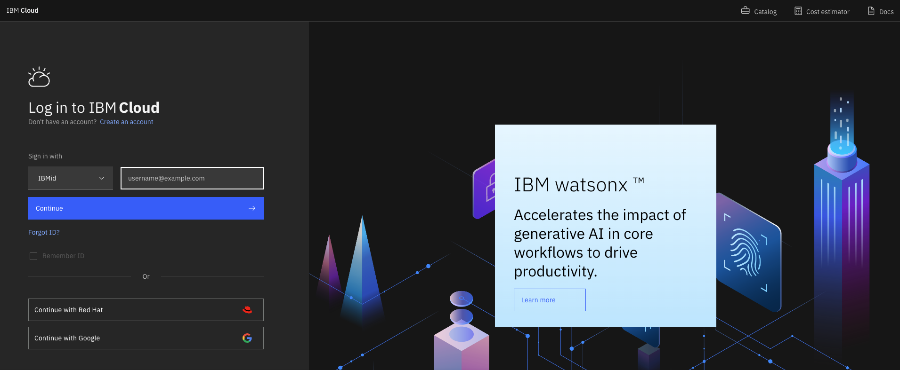

### Step 1.2 — Open the Resource List

After logging in, click the **hamburger menu** (☰) in the top-left corner to open the navigation menu, then click **Resource list**.

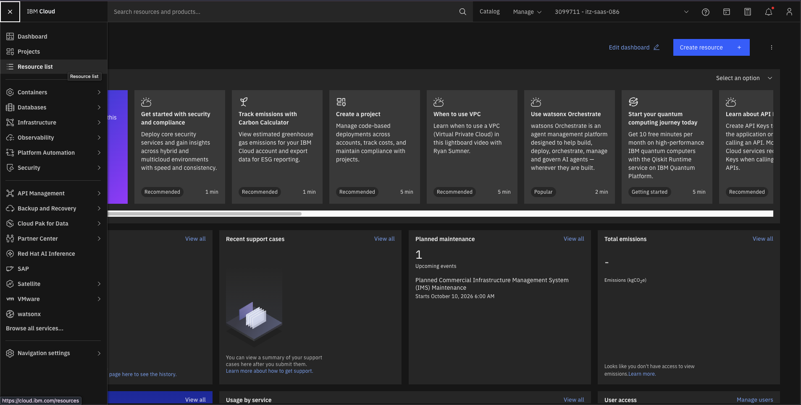

### Step 1.3 — Locate the watsonx Orchestrate Instance

In the Resource list, expand the **AI / Machine Learning** section. Find the row whose name corresponds to the **watsonx Orchestrate** product and click it to open the service instance details.

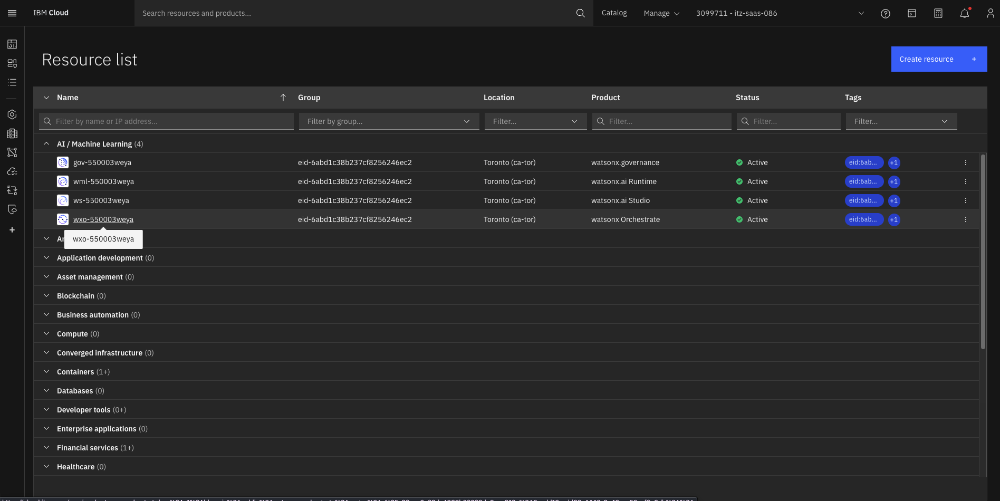

### Step 1.4 — Launch watsonx Orchestrate

On the service instance details page, click **Launch watsonx Orchestrate**. This opens the WXO console in a new browser tab.

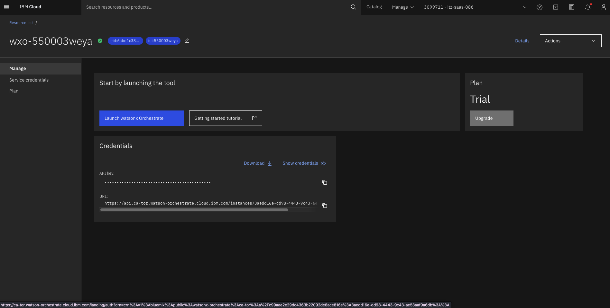

You will land on the watsonx Orchestrate home screen.

---

## Part 2 — Create the Work Order Extraction Agent

### Step 2.1 — Navigate to Build

Click the **hamburger menu** (☰) in the top-left corner and click **Build**.

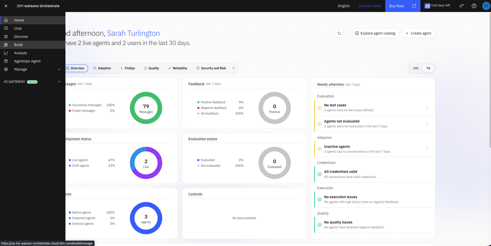

### Step 2.2 — Create a New Agent

Click **Create agent**, then click **Create from scratch**.

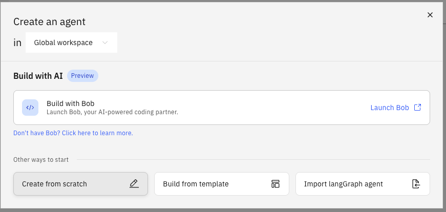

### Step 2.3 — Fill in the Agent Name, Description, and Instructions

> ⚠️ **Important — Multi-Tenant Sharing:** All workshop participants share the same WXO tenant. You **must** append your initials to the agent name to avoid overwriting a colleague's work.

Fill in the following fields:

**Agent Name:**
```
Work Order Extraction Agent_<initials>
```
For example: `Work Order Extraction Agent_js`

**Description:**
```
You are the Maintenance Records Assistant for an airline's maintenance organization. You process aircraft maintenance work orders end to end: you take in raw documents, coordinate specialized agents to extract and analyze them, and deliver a final report that maintenance leadership can act on.
```

**Instructions:** paste the full block below into the Instructions field:

```
- When the user indicates they want to process, extract, review, or summarize work orders (for example, uploading maintenance documents or asking to "run the work orders"), start the work order extraction flow.
- If the user's intent is unclear, ask one short question to confirm whether they want to start the extraction flow.
- You can briefly explain what you do and what file types you accept if the user asks.
- Only help with aircraft maintenance work order processing. If the user asks about anything else, politely say it's outside what you can help with and offer to start the work order extraction flow instead. Do not answer out-of-scope questions, even partially.
- Never provide maintenance instructions, airworthiness determinations, or return-to-service decisions, even if asked. Direct those to qualified maintenance personnel.
```


---

## Part 3 — Add the Agentic Workflow Tool

### What is an Agentic Workflow?

Agentic workflows are specialized tools that allow an agent to run a sequence of activities within a single, reusable structure. These activities include calling tools, prompting for user input, logical logic blocks, or branching logic.

Rather than handling each step individually, agents can start an agentic workflow to manage the entire process from beginning to end. Agentic workflows are ideal for tasks that require coordination across systems or multiple decision points.

### Step 3.1 — Open the Tools Tab

Click the **Tools** tab at the top of the agent editor.

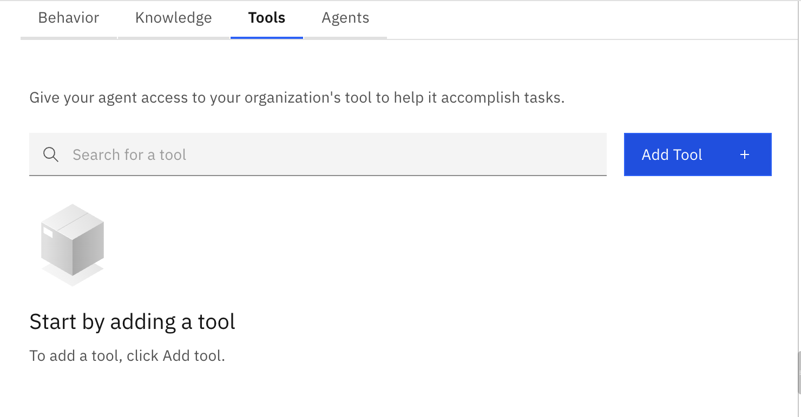

### Step 3.2 — Select Agentic Workflow

Click **Add tool**, then click **Agentic workflow**.

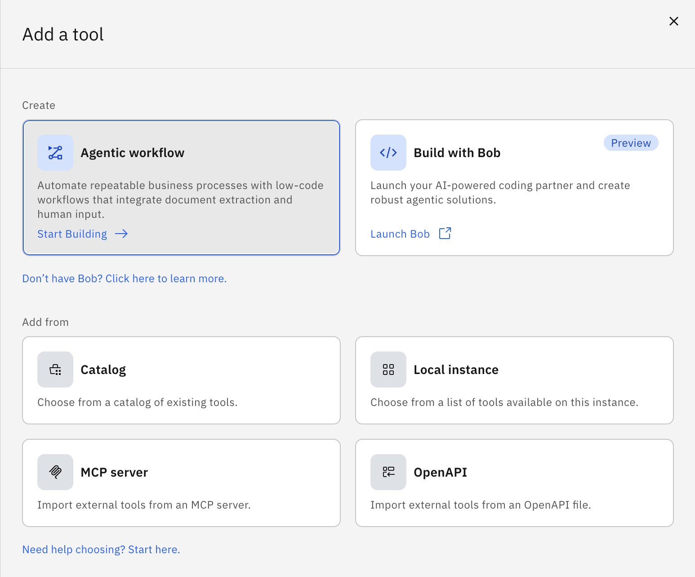

### Step 3.3 — Name the Workflow

In the workflow name field, enter:

```
Work Order Extraction - <your initials>
```

For example: `Work Order Extraction - JS`

Then click **Start building**.

---

## Part 4 — Build the Workflow: Prompt the User for a File

### Step 4.1 — Add Your First Step

Click **Add your first step +**. Take a moment to notice the activity options that appear — these represent the different types of steps you can add to a workflow, including tool calls, user prompts, and logic blocks.

### Step 4.2 — Add a Present to User Message

To start, you want to prompt the end user to upload their work order file. Under **User activities**, click **Present to User**, then click **Message**.

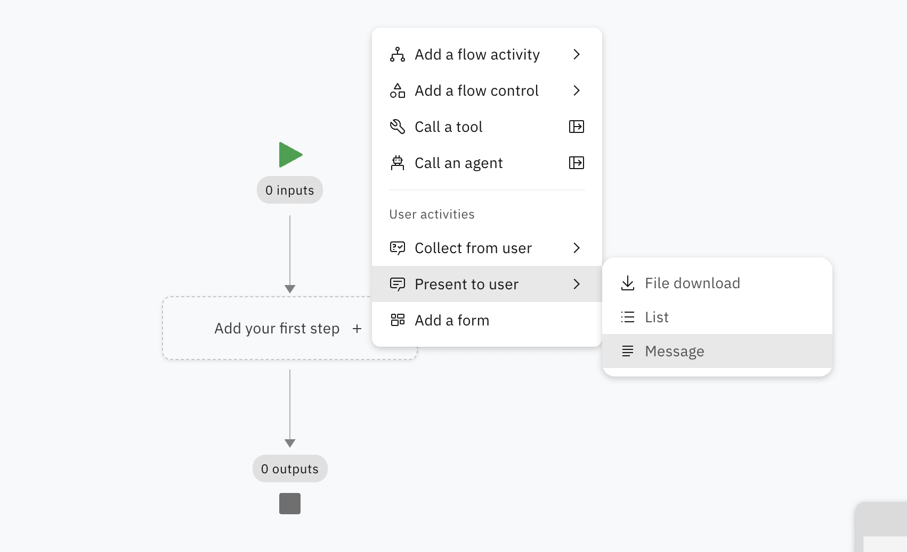

### Step 4.3 — Configure the Message

Click the **Message 1** activity that appears in the workflow canvas. In the **Output message** field, enter:

```
Please upload the work order you would like to extract.
```

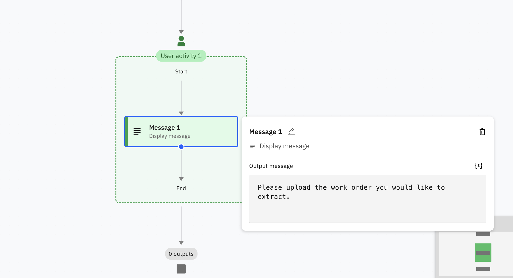

### Step 4.4 — Add a File Upload Step

Still within the green user activity box, click the **+** sign directly below the Message 1 step. Then click **Collect from user**, then click **File upload**. This is where the user will upload their work order for extraction.

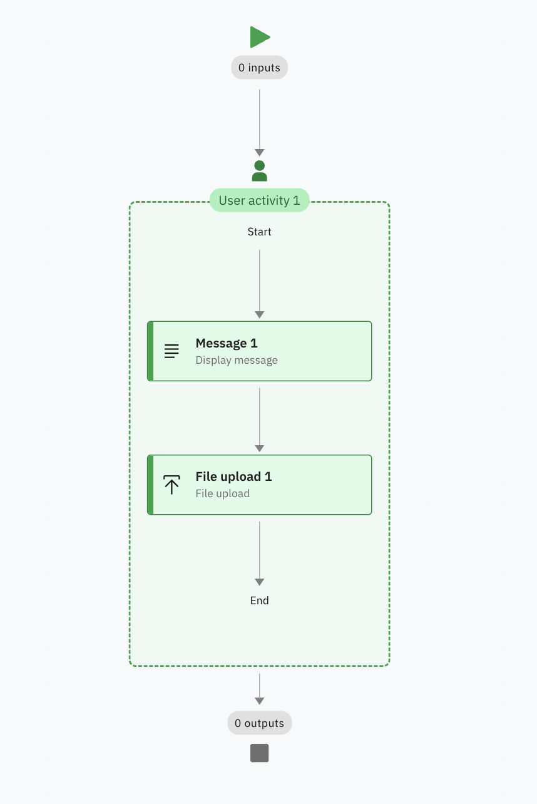

---

## Part 5 — Add the Document Extractor

### Step 5.1 — Add a Flow Activity Outside the User Box

Outside of the green user activity box, click the **blue +** sign. Then click **Add a flow activity**, then **Document extractor**, then **Unstructured**.

### Step 5.2 — Upload the Sample Document

Upload the file **`Gulfstar_1.pdf`** from the workshop assets. Allow the document to process before continuing.

### Step 5.3 — Define Your Extraction Schema

Next, you will define the **fields** you want the extractor to pull from the document. Click **Add field**, type the field name, and press **Enter**. The extractor will attempt to extract the value automatically.

> 💡 If the extracted value is incorrect, you can manually type the correct value directly, or click **Edit** on the field to provide a description and examples that help the model identify the right value in future documents.

Add the following fields one at a time:

| Field Name |
|---|
| Aircraft Model |
| Certifying Staff |
| Part Number |
| Rectification |
| Discrepancy |
| Date Performed |

### Step 5.4 — Verify the Document

When you have added all fields, click **Verify document**.

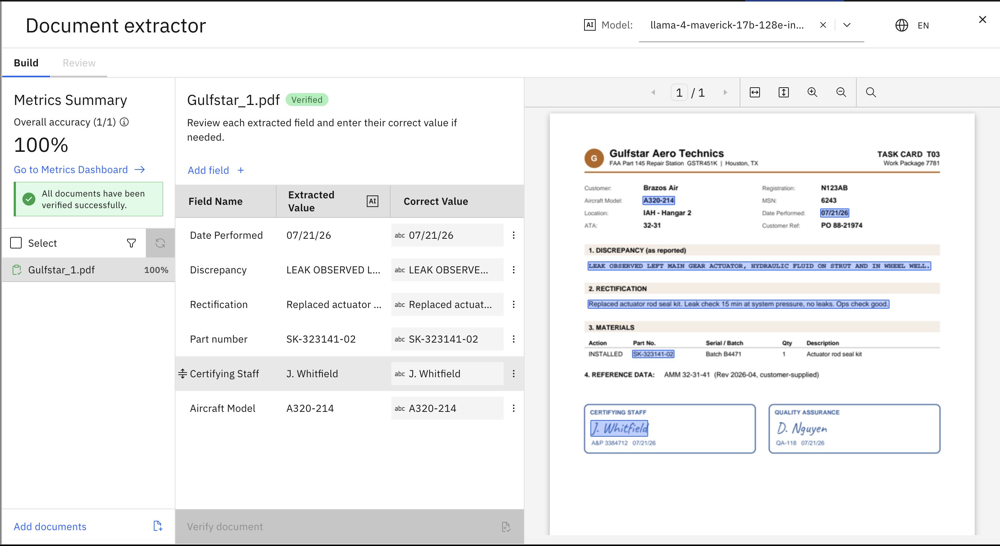

> **Note:** You can add additional example documents to the extractor to improve accuracy — particularly useful when work orders come in different formats or layouts. For the purposes of this lab, one document is sufficient.

---

## Part 6 — Generate a Plain-Language Summary

Now that the document extractor has pulled out the key fields, we need to do something with them. In this step, you will add a Generative Prompt activity that turns the extracted data into a clear, easy-to-read summary for someone who may not be familiar with the raw work order format.

### Step 6.1 — Add a Generative Prompt Activity

Below the Document Extractor step, click the **blue +** sign. Click **Add a flow activity**, then click **Generative prompt**.

### Step 6.2 — Enter the System Prompt

In the **System prompt** field, paste the following:

```
You are a Maintenance Summary Writer for an airline. You receive work order records that have already been extracted from source documents, along with any findings flagged by the review step (repeat defects, missing sign-offs, past-due deferrals, etc.). Your job is to turn this into clear, accurate summaries for people who don't read raw work orders.
```

### Step 6.3 — Enter the User Prompt and Map Variables

In the **User prompt** field, paste the following:

```
Summarize these key fields into a summary for someone unfamiliar with the work order:
Aircraft model:
Certifying staff:
Date performed:
Discrepancy:
Part number:
Rectification:
```

After pasting, you need to link each field label to its extracted value. For each field, place your cursor at the end of the field label line, then click the **Select variable** button (`{x}`) at the top of the prompt box. Click **Document extractor**, then click the matching field name.

Repeat this for all six fields so that each line pulls its value directly from the Document Extractor step. When complete, the prompt should look like the screenshot below.

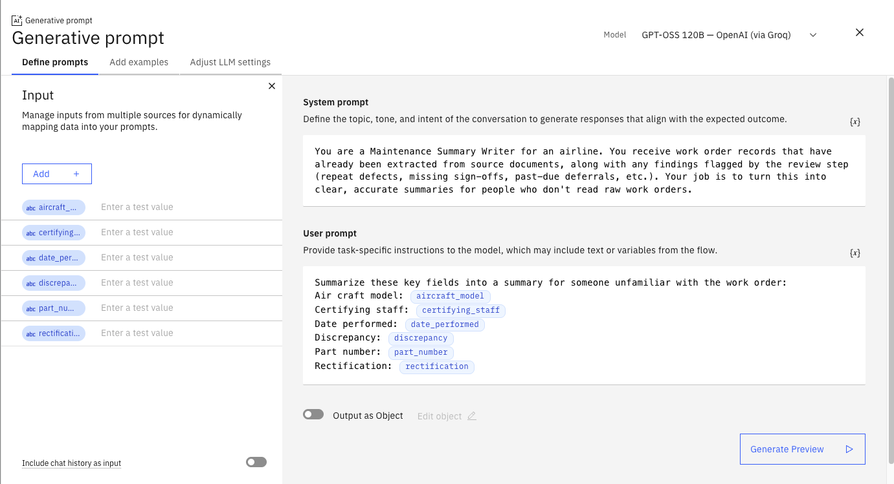

### Step 6.4 — Close the Activity Panel

Click the **X** in the top-right corner of the panel when finished.

### Step 6.5 — Add a Present to User Message

Below the **Generative prompt** activity (outside any existing green user activity box), click the **blue `+` sign**. In the activity picker, click **Present to User**, then click **Message**.

This creates a new **User activity 2** box on the canvas containing a **Message 2** step.

### Step 6.6 — Configure Message 2

Click the **Message 2** activity on the canvas. In the **Output message** field, type:

```
Here is the summary of your work order:
```

With your cursor at the end of that text, click the **`{x}` variable button** to the right of the Output message field. In the variable picker:

1. Click **Generative prompt**
2. Click **value**

The Output message field should now read:

```
Here is the summary of your work order:
Generative prompt.value
```

When finished, it should look like the screenshot below.

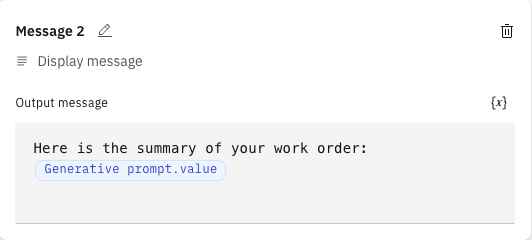

### Step 6.7 — Save the Workflow

Your completed flow should look like the screenshot below, showing all steps in sequence:

- **User activity 1** → Message 1 + File upload 1
- **Document extractor**
- **Generative prompt**
- **User activity 2** → Message 2

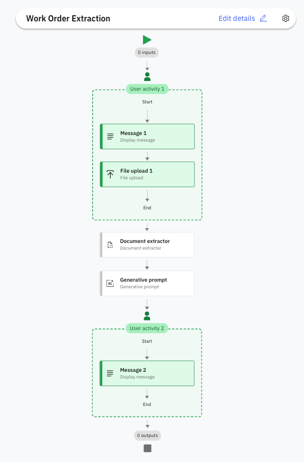

Click the blue **Done** button in the top-right corner of the workflow builder.

---

## What You Accomplished

In this lab, you:

1. ✅ Logged into the watsonx Orchestrate browser UI
2. ✅ Navigated to Build and created a new agent from scratch
3. ✅ Configured the agent name, description, and instructions for the work order extraction flow
4. ✅ Opened the Tools tab, selected Agentic workflow, named it, and started building
5. ✅ Added a Present to User message step to prompt the user for a work order file upload
6. ✅ Added a Document Extractor step, defined the extraction schema, and verified the document
7. ✅ Added a Generative Prompt step with variables mapped from the Document Extractor
8. ✅ Added a second Present to User message displaying the generated summary and saved the workflow

---

## Part 7 — Test the Agent

Now that the workflow is built, you will test it end to end using the Draft Preview panel.

### Step 7.1 — Start the Flow

In the agent chat input, type:

```
I want to start a work order extraction
```

Press **Enter**. The agent will recognise your intent and start the workflow. You will see the first message from **User activity 1** appear, followed by the **File upload** activity.

### Step 7.2 — Upload the Work Order

Click **Add files** and upload **`Gulfstar_2.pdf`** from the workshop assets. Press **Enter** to submit the file.

Allow the agent a moment to process the document and extract the fields.

### Step 7.3 — Review the Extraction

Because the Document Extractor uses a **confidence threshold of 95%**, any extraction where confidence falls below that level will pause and ask the end user to review the values before continuing. You can adjust this threshold at any time by opening the Document Extractor activity in the workflow.

When prompted, click **View** to open the extracted values. Check each field and correct any values that look wrong. When you are satisfied, click the blue **Submit** button at the bottom, then click **Confirm and submit**.

### Step 7.4 — Review the Summary

The Generative prompt will now run and produce a plain-language summary of the work order. Read through the output.

> **Note:** The summary may not look identical to the screenshot below — this is expected. Because the summary is generated by a large language model, the exact wording will vary between runs. What matters is that the key fields from the work order are accurately reflected.

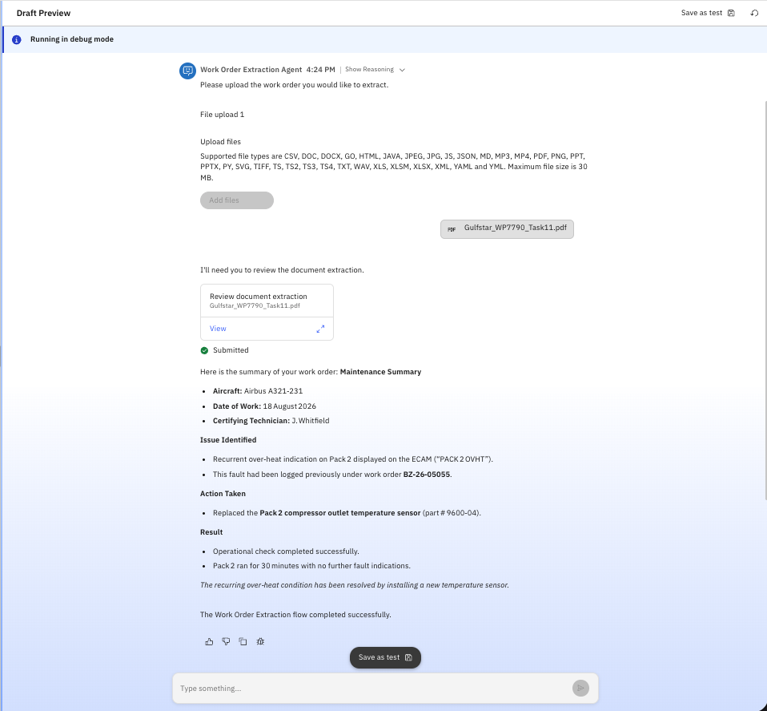

---

## Keep Exploring

You have now built and tested a complete end-to-end agentic workflow. Here are some ideas to take it further:

- **Try different documents** — upload other work order PDFs to see how the extractor handles varying formats and layouts. Add additional example documents to the Document Extractor to improve accuracy across different templates.
- **Add more extraction fields** — open the Document Extractor activity and define new fields to capture more detail from each document.
- **Adjust the confidence threshold** — experiment with raising or lowering the 95% threshold in the Document Extractor to see how it affects when the review prompt is triggered.
- **Modify the generative prompt** — edit the system or user prompt in the Generative Prompt activity to change the tone, structure, or level of detail in the summary output.
- **Add a logic branch** — explore the flow activity options to add conditional logic, such as routing high-priority discrepancies to a different message or escalation path.
