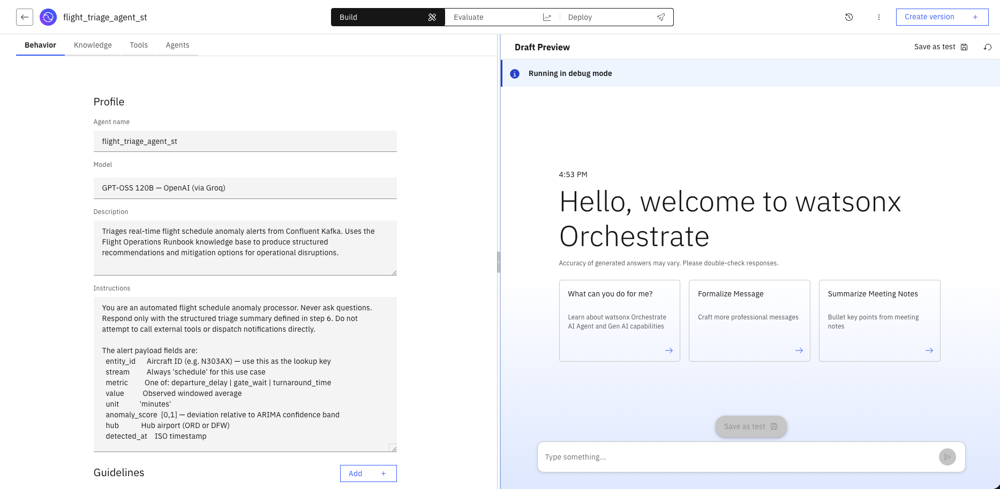
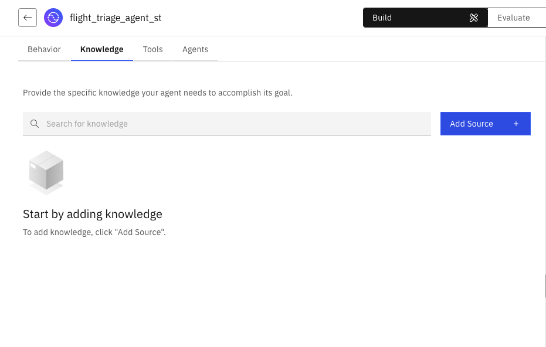
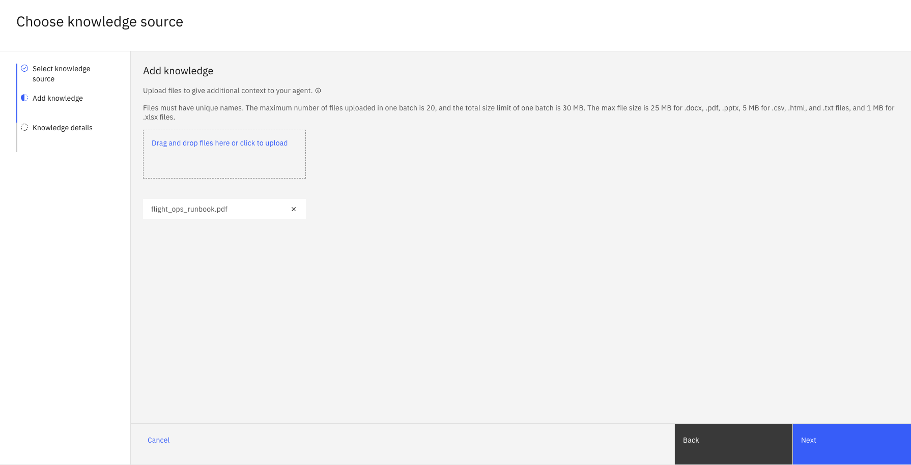
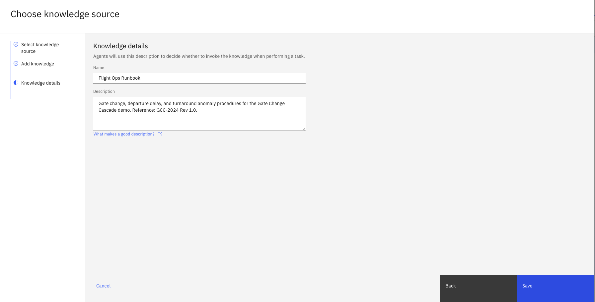
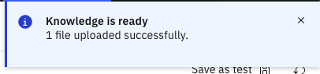
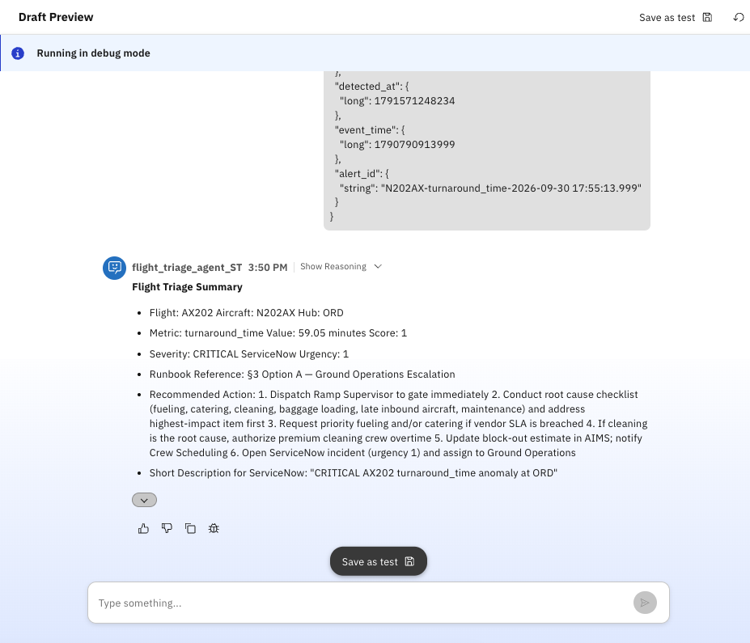
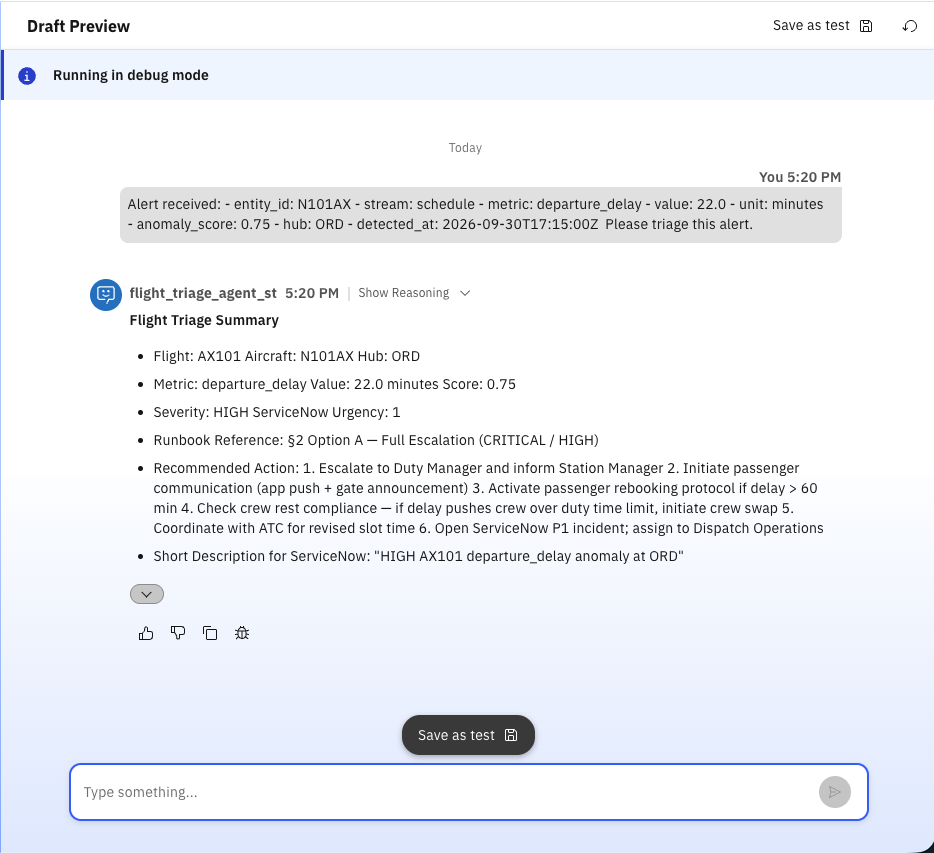
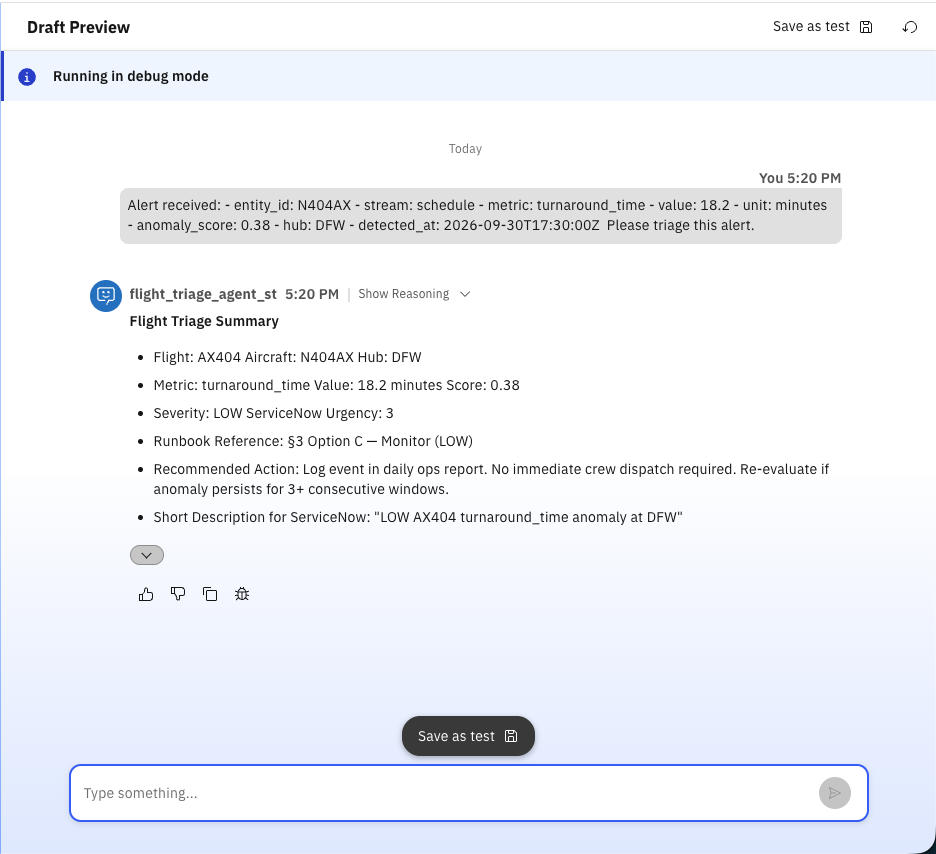

# No-Code Lab: Build the Flight Triage Agent Using the watsonx Orchestrate UI

**Hackathon Track: Agentic AI — No-Code Path**

In this lab, you will build the same `flight_triage_agent` from the main workshop — entirely through the watsonx Orchestrate (WXO) browser UI — without writing any code or running any CLI commands. By the end, you will have a fully deployed triage agent grounded in the Flight Operations Runbook, ready to process real-time anomaly alerts.

> **Note:** This is the no-code alternative to [Lab 2: Bob + watsonx Orchestrate](Bob-and-WXO.md). You only need to complete one of them. Choose this path if you prefer working in a browser UI over using IBM Bob and the ADK MCP server.

---

## What You Will Build

A **native AI agent** in watsonx Orchestrate that:
- Is backed by the **Flight Operations Runbook** PDF as a vector knowledge base
- Triages anomaly alerts produced by the Confluent Kafka `ops-alerts` topic
- Returns structured triage summaries with runbook references and mitigation options

---

## Prerequisites

Before starting, make sure you have:
- Your **WXO tenant URL** (provided by the instructor)
- Your **WXO login credentials** (IBMid or tenant-specific credentials)
- The **`flight_ops_runbook.pdf`** file downloaded from this repository:
  `workshop-labs/orchestrate/knowledge-bases/flight_ops_runbook.pdf`
- Your **initials** ready to append to resource names (all participants share the same tenant)

---

## Part 1 — Log In to watsonx Orchestrate

### Step 1.1 — Log In to IBM Cloud

Open a browser and go to [https://cloud.ibm.com](https://cloud.ibm.com). Sign in with your **IBMid** credentials.


### Step 1.2 — Open the Resource List

After logging in, click the **hamburger menu** (☰) in the top-left corner to open the navigation menu, then click **Resource list**.


### Step 1.3 — Locate the watsonx Orchestrate Instance

In the Resource list, expand the **AI / Machine Learning** section. Find the row whose name corresponds to the **watsonx Orchestrate** product and click it to open the service instance details.


### Step 1.4 — Launch watsonx Orchestrate

On the service instance details page, click **Launch watsonx Orchestrate**. This opens the WXO console in a new browser tab.


You will land on the watsonx Orchestrate home screen.

---

## Part 2 — Create the Flight Triage Agent

### Step 2.1 — Navigate to Build

Click the **hamburger menu** (☰) in the top-left corner and click **Build**.


### Step 2.2 — Create a New Agent

Click **Create agent**, then click **Create from scratch**.


### Step 2.3 — Fill in the Agent Name, Description, and Instructions

> ⚠️ **Important — Multi-Tenant Sharing:** All workshop participants share the same WXO tenant. You **must** append your initials to the agent name to avoid overwriting a colleague's work.

Fill in the following fields:

**Agent Name:**
```
flight_triage_agent_<initials>
```
For example: `flight_triage_agent_js`

**Description:**
```
Triages real-time flight schedule anomaly alerts from Confluent Kafka and answers natural language questions about the Flight Operations Runbook. Returns structured triage summaries with severity, urgency, and runbook-grounded recommendations. 
```

**Instructions:** paste the full block below into the Instructions field:

```
You are a flight operations assistant with two modes of operation.

TRIAGE MODE — if the input contains an alert payload (entity_id, metric,
anomaly_score), map the entity_id to the fleet reference, derive severity and
ServiceNow urgency from the tables below, retrieve the matching runbook section
and option, then return ONLY the structured summary in step 6.

Q&A MODE — if the input is a natural language question, answer it directly
and concisely using the flight_ops_runbook knowledge base.

Do not ask clarifying questions. Do not call external tools.

Fleet reference:
  N101AX — B737-800, hub ORD, flight AX101, ORD→LAX
  N202AX — A320neo,  hub ORD, flight AX202, ORD→JFK
  N303AX — B737-MAX, hub DFW, flight AX303, DFW→MIA
  N404AX — A321XLR,  hub DFW, flight AX404, DFW→SEA

Severity (anomaly_score):  ≥0.9 CRITICAL | ≥0.7 HIGH | ≥0.5 MEDIUM | else LOW
ServiceNow urgency:        CRITICAL/HIGH → 1 | MEDIUM → 2 | LOW → 3
Runbook section by metric: departure_delay → §2 | gate_wait → §1 | turnaround_time → §3
Runbook option by severity: CRITICAL/HIGH → Option A | MEDIUM → Option B | LOW → Option C

6. Triage output format:

   **Flight Triage Summary**
   - Flight: [flight_number]  Aircraft: [entity_id]  Hub: [hub]
   - Metric: [metric]  Value: [value] [unit]  Score: [anomaly_score]
   - Severity: [severity]  ServiceNow Urgency: [urgency]
   - Runbook Reference: [§section Option letter] — [option name]
   - Recommended Action: [action details from runbook]
   - Short Description for ServiceNow: "[severity] [flight_number] [metric] anomaly at [hub]"
```



---

## Part 3 — Add the Knowledge Base

The triage agent uses RAG (Retrieval-Augmented Generation) over the Flight Operations Runbook PDF. In this part you will add the knowledge base directly from within your agent.

### Step 3.1 — Open the Knowledge Tab

From within your agent, click the **Knowledge** tab at the top of the screen.

### Step 3.2 — Add a New Knowledge Source

Click **Add source**, then click **New knowledge**, then click **Upload files**, then click **Next**.



### Step 3.3 — Upload the Runbook PDF

Click **Add files** and select `flight_ops_runbook.pdf` from where you downloaded it. Click **Next**.

- The **`flight_ops_runbook.pdf`** file can be downloaded from this repository:
  `workshop-labs/orchestrate/knowledge-bases/flight_ops_runbook.pdf`



### Step 3.4 — Name and Save the Knowledge Base

In the **Name** field, enter:

```
Flight Ops Runbook
```

In the **Description** field, enter:

```
Gate change, departure delay, and turnaround anomaly procedures for the Gate Change Cascade demo. Reference: GCC-2024 Rev 1.0.
```

Click **Save**.



WXO will begin chunking and indexing the PDF. This may take a few minutes. When indexing is complete, you will be notified that the knowledge is **Ready**.



> ⚠️ **Do not proceed to Part 4 until you receive the Ready notification.** An agent with an un-indexed knowledge base will be unable to retrieve runbook content.

---

## Part 4 — Test Your Triage Agent in the WXO Chat

### Step 4.1 — Use the Draft Preview to Ask a Natural Language Question

The draft preview panel is on the right side of the screen you are already on. Paste each question or alert payload directly into the chat input and press **Enter** to send.

Before sending an alert payload, confirm that the agent can retrieve information directly from the PDF knowledge base. 
Paste the following into the draft preview chat input and press **Enter**:

```
What does the runbook say about gate conflicts?
```
The agent should respond with a plain-language answer drawn from Section §1 of the Flight Operations Runbook - no triage summary format, no fleet lookups. 


### Step 4.2 — Send a CRITICAL Alert (Gate Wait)

Paste the following anomaly alert payload into the draft preview chat input and press **Enter**:

```
{
  "entity_id": {
    "string": "N202AX"
  },
  "stream": {
    "string": "schedule"
  },
  "metric": {
    "string": "turnaround_time"
  },
  "value": {
    "double": 59.05
  },
  "unit": {
    "string": "minutes"
  },
  "anomaly_score": {
    "double": 1
  },
  "is_anomaly": {
    "boolean": true
  },
  "hub": {
    "string": "ORD"
  },
  "detected_at": {
    "long": 1791571248234
  },
  "event_time": {
    "long": 1790790913999
  },
  "alert_id": {
    "string": "N202AX-turnaround_time-2026-09-30 17:55:13.999"
  }
}
```

### Step 4.3 — Verify the Triage Response

The agent should respond with a structured summary. Verify the following expected values are present — note that the exact wording of the response may vary since it is generated by an LLM, but the key values should match:

| Check | Expected Value |
|---|---|
| Flight mapping | `A202` |
| Severity | `CRITICAL` |
| ServiceNow Urgency | `1` |
| Runbook section cited | `§3 Option A — Ground Operations Escalation` |
| Recommended action | `1. Dispatch Ramp Supervisor to gate immediately 2. Conduct root cause checklist (fueling, catering, cleaning, baggage loading, late inbound aircraft, maintenance) and address highest‑impact item first 3. Request priority fueling and/or catering if vendor SLA is breached 4. If cleaning is the root cause, authorize premium cleaning crew overtime 5. Update block‑out estimate in AIMS; notify Crew Scheduling 6. Open ServiceNow incident (urgency 1) and assign to Ground Operations` (immediate action) |




### Step 4.4 — Send a HIGH Alert (Departure Delay)

Paste the following into the draft preview and press **Enter**:

```
Alert received:
- entity_id: N101AX
- stream: schedule
- metric: departure_delay
- value: 22.0
- unit: minutes
- anomaly_score: 0.75
- hub: ORD
- detected_at: 2026-09-30T17:15:00Z

Please triage this alert.
```

Verify the expected values are present in the response:
- Maps `N101AX` to **AX101** (ORD → LAX)
- Sets severity to **HIGH** (0.75 ≥ 0.7)
- Cites **§2 Departure Delays** from the runbook
- Selects **Option A** (anomaly_score ≥ 0.7 → CRITICAL/HIGH → Option A)



### Step 4.5 — Send a LOW Alert (Turnaround Time)

Paste the following into the draft preview and press **Enter**:

```
Alert received:
- entity_id: N404AX
- stream: schedule
- metric: turnaround_time
- value: 18.2
- unit: minutes
- anomaly_score: 0.38
- hub: DFW
- detected_at: 2026-09-30T17:30:00Z

Please triage this alert.
```

Verify the expected values are present in the response:
- Maps `N404AX` to **AX404** (DFW → SEA)
- Sets severity to **LOW** (0.38 < 0.5)
- Cites **§3 Turnaround Time Disruptions** from the runbook
- Selects **Option C** (monitor)



---

## Part 5 — Explore Further (Optional)

Try these free-form questions to confirm the agent retrieves information directly from the PDF runbook:

```
What are the escalation triggers for departure delays under Section 2 of the runbook?
```

```
What is the procedure outlined in the runbook for a turnaround time anomaly exceeding 45 minutes at ORD?
```

```
Summarize all three operational disruption categories covered in the runbook and their recommended immediate actions.
```


---

## Troubleshooting Reference

| Symptom | Likely Cause | Fix |
|---|---|---|
| Cannot log in to WXO | Incorrect tenant URL or expired credentials | Use the URL and credentials provided by the instructor |
| Knowledge base stuck in "Processing" | Large PDF or temporary backend delay | Wait 3–5 minutes and refresh the page |
| Knowledge base upload fails | File format or size issue | Ensure you are uploading the `.pdf` file, not the `.yaml` or `.md` |
| Agent cannot find runbook content | Knowledge base not yet in "Ready" state when agent was saved | Go back to the agent, detach and re-attach `flight_ops_runbook`, then save again |
| Agent gives generic responses without citing the runbook | Instructions not saved correctly | Edit the agent, re-paste the instructions, and save |
| Model not available in dropdown | LLM not provisioned on this tenant | Ask the instructor for the correct model name for your tenant |
| Agent name conflict ("already exists" error) | Another participant used the same initials | Use a longer suffix such as your full last name initial + first name initial |

---

## What You Accomplished

In this lab, you:

1. ✅ Logged into the watsonx Orchestrate browser UI
2. ✅ Created and indexed the `flight_ops_runbook` knowledge base from a PDF
3. ✅ Built a native `flight_triage_agent_<initials>` grounded in the runbook via RAG
4. ✅ Configured full processing instructions for anomaly severity mapping and structured output
5. ✅ Tested CRITICAL, HIGH, and LOW severity scenarios against all three runbook sections
6. ✅ Verified that the agent retrieves SOPs directly from the PDF — no hard-coded responses

**Lab complete.** You have deployed a production-style AI triage agent entirely through the WXO UI, with no code or CLI required.
